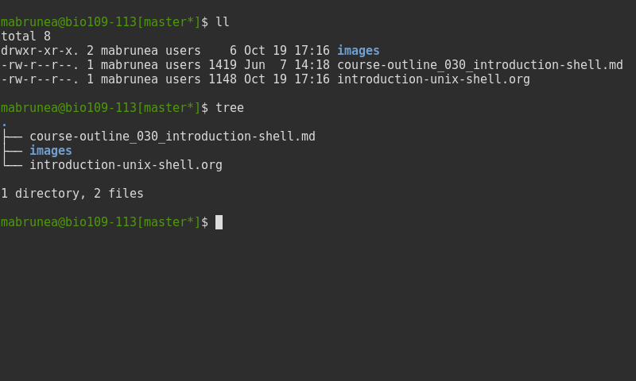

Before the course
-----------------

Prerequisites:
-   you have used a computer before and you are know what are "files"
    and "directories" (also called "folders") on a computer

After the course
----------------

You will know how to:
-   connect to a remote server
-   navigate around files and folders from the command line
-   create, copy, move and delete files and folders
-   run programs from the command line
-   combine commands to perform complex operations
-   create scripts to automate task

What is the shell?
==================



In brief:
-   Command-line interface, looks old-fashioned but very convenient
-   Main interface when you want to login to **remote servers** (e.g.
    CSC servers, workstation)
-   Also present in **Linux** distributions for personal computers and
    **Macs**
-   With **Windows**, the `cmd` prompt is a bit similar (text-based) but
    not as powerful

Usage:
-   Often the only interface for remote connections
-   Powerful built-in commands
-   **Automate repetitive tasks**
-   Shell scripts to **reproduce** data manipulation

Where can we find the shell?
============================

To find a shell:
-   On **GNU/Linux** and **MacOS** systems: open a **terminal**. This
    will provide you with a Unix-like shell on both systems.
-   On **Windows**: run `cmd.exe` or `cmd`. This shell is quite
    different from the Unix-like shell found in Linux and MacOS. To
    obtain a Unix shell on Windows, one can install the Cygwin tools.
-   It is strongly recommended to learn how to use a **Unix shell** (the
    most likely to be installed on a **remote server**).

One shell or several shells?
----------------------------

-   A shell: a program providing an **interface** between the user and
    the computer. **Different shells exist**.
-   The most popular and widely used shell is probably **bash**. It is
    the default shell in most GNU/Linux distributions.
-   If you learn how to use **bash**, you will be able to use most
    **remote servers** you'll have to connect to, and also the
    **terminal** from MacOS or the **Cygwin** tools on Windows.

\*One word on terminology\*: During the course, we will often say
interchangeably "the terminal", "the console", "the shell" or "bash".

The CSC center in Kajaani
=========================


Meet the Taito cluster (`taito.csc.fi`)
=======================================


Meet bio109-113
===============

-   Today, we are going to connect to a remote workstation on the other
    side of the lake: `bio109-113`.
-   Runs a GNU/Linux system
-   Provides a **bash** shell (similar to **Taito**)

Hands-on practice
=================

1. Connection to a remote shell
-------------------------------

The plan:
-   Using our workstation in Ambiotica (student account)
-   Tools: **putty** (Windows) or **ssh** (Mac and GNU/Linux)
-   A word about **ssh** and the **security of connections**?

### 1.1 How to use ssh?

-   `ssh` syntax:

    ``` {.bash}
    ssh username@host
    ```

-   `username` - this is your identifier on the host machine:
    -   `matthieu`
    -   `matthieuBruneaux`
    -   `mabrunea`
    -   `jyybio48`
-   `host` - this is the address of the machine you are connecting to:
    -   `taito.csc.fi`
    -   `130.234.109.113`

### 1.2 Connect to your student account

Student account:
-   Logins: `jyybio01` to `jyybio25`
-   Password: on the whiteboard!

Connection:
-   From a terminal (Mac or GNU/Linux):

    ``` {.bash}
    ssh jyybioxx@130.234.109.113
    ```

    where `xx` is your student number.
-   From Putty: ask a teacher if needed

2. First contact with the shell
-------------------------------

### 2.1 Just after connection:

-   What you see after connection is the **shell prompt**. It tells you
    the shell is ready to receive your input:

    ``` {.example}
    jyybioxx@bio109-113$
    ```

-   `jyybioxx` is your username, `bio109-113` is the host server to
    which you are connected.

### 2.2 Execute a command (`ls`)

-   The shell **reads** and **executes** commands you enter at the
    prompt, and **prints** the output.
-   Type:

    ``` {.bash}
    ls
    ```

    and press `RETURN`. You should see:

    ``` {.example}
    practicals  readme
    ```

-   You just ran the `ls` command which produces an output: the list of
    files and folders present in the current directory.
-   Try another command:

    ``` {.bash}
    whoami
    ```

    What does this command do?

### 2.3 Execute a command (`pwd`)

-   When you login to a server, you are automatically sent to your
    home folder.
-   You can see where you are by typing:

    ``` {.bash}
    pwd
    ```

    which produces:

    ``` {.example}
    /home/jyybioxx
    ```

-   So you are now in the folder `jyybioxx`, which is itself contained
    in `home`, which is at the root of the file system (`/`, there is no
    parent directory above).

3. Adding options to a command
------------------------------

-   You can add options to a command with the dash sign `-`:

    ``` {.bash}
    ls -l
    ```

    (this is `-l`, not `-1`)
-   This runs the `ls` command with the `-l` option, which produces a
    detailed output:

    ``` {.example}
    total 4
    drwxr-xr-x. 3 jyybioxx users 23 Nov  9 16:22 practicals
    -rw-r--r--. 1 jyybioxx users 25 Nov  9 16:22 README
    ```

-   Now you can see the date of last modification of the files and some
    other information.

4. A word about rights
----------------------

### 4.1 The rights system

-   In a Unix system, every file has a **owner** and belongs to a
    **group**
-   Every file has rights for **reading**, **writing** and **execution**
-   Those rights are set for three categories of users: **owner**,
    **group** and **others**

### 4.2 `ls -l` output

``` {.example}
total 4
drwxr-xr-x. 3 jyybioxx users 23 Nov  9 16:22 practicals
-rw-r--r--. 1 jyybioxx users 25 Nov  9 16:22 README
```

-   The very first letter for `practicals` row (`d`) means this row is
    a directory. Let's consider the nine following characters
    (`rwx------`)
-   The three first letters are rights for the owner, the next three
    rights for the group, and the last three rights for others.
-   If a letter is replaced by a dash, the right is not granted.
-   What do those mean?

    ``` {.example}
    -rwx------
    -r--r--r--
    -rwxr--r--
    drwxr-xr-x
    ```

5. Basic folder navigation
--------------------------

### 5.1 `cd` command

-   We can navigate from folder to folder using the `cd` command:

    ``` {.bash}
    ls
    cd practicals
    ls
    cd ecoli-data
    ls
    ```

-   You can see there are already some files in this folder. Let’s ask
    for more details with `ls -l`

-   How many files are there? How large are they?

### 5.2 Combining options for `ls`

-   We can ask for more human-readable sizes with:

    ``` {.bash}
    ls -l -h
    ```

-   Can you see the difference with `ls -l`? What does `ls -h` do?

-   We could also combine both options: `ls -lh` . Try it.

### 5.3 Moving to the parent directory

-   We can go back through the parent folders using `cd ..`

    ``` {.bash}
    pwd      # Where are you at this point?
    cd ..
    pwd      # And now?
    ls
    cd ..
    pwd      # And here?
    ls
    cd .. 
    pwd      # And here?
    ls
    ```

### 5.4 Going back to the home directory

-   A faster way to go back to your home directory, from any starting
    directory, is just to type `cd` without any argument:

    ``` {.bash}
    pwd
    cd
    pwd
    ```

-   Go back to the `ecoli-data` subfolder and back again to your home
    directory using `cd`

-   From your home folder, instead of typing `cd practicals` and then
    `cd
     ecoli-data` to go through folder one at a time, we can go directly
    to the subfolder by typing:

    ``` {.bash}
    cd practicals/ecoli-data
    pwd
    ls
    ```

#### Shortcut for the home folder

-   Another way to go to the home folder is to use the `~` character:
    this is automatically replaced by the path to your home folder by
    `bash`.

    ``` {.bash}
    cd              # Back to your home folder
    cd practicals
    cd ~            # Bash understands "~" as "/home/jyybioxx"
    cd ..
    pwd             # Where are you at this stage?
    cd ~/practicals # Where are you now?
    ```

6. Creating folders
-------------------

### 6.1 The `mkdir` command

-   Go to the `practicals` folder and create a new folder in it:

    ``` {.bash}
    cd ~/practicals
    mkdir results
    cd results
    ls
    ```

### 6.2 Exercise

-   Create the following directory structure:

    ``` {.bash}
    ~/practicals/scripts/python/modules/seqAnalysis
    ```

-   Go back to your home folder.

7. Auto-completion
------------------

### 7.1 The magic `TAB` key

-   Let’s go into the `seqAnalysis` folder, but let’s be lazy:

    ``` {.bash}
    cd         # Start from your home folder
    cd pr      # Press TAB at this point
    ```

-   What happened?

-   Use this feature to go quickly to `seqAnalysis`. What is the minimum
    number of keystrokes you have to use to go there from your home
    folder?

### 7.2 Remember!

-   When you press `TAB`, the shell tries to complete what you just
    typed by itself. This **auto-completion** feature of the shell is
    very convenient and will save you a lot of typing!

### 7.3 Test auto-completion

-   Now create a folder:

    ``` {.bash}
    ~/practicals/scripts/python/modifiedSources
    ```

-   Go back to your home folder, and go into `modifiedSources` using the
    `TAB` completion as much as you can. What do you notice?

### 7.4 Double `TAB`

-   Now create the folder:

    ``` {.bash}
    ~/practicals/scripts/python/modularComponents
    ```

-   Type:

    ``` {.bash}
    cd ~/practicals/scripts/python/mod   # Press TAB twice here
                                         # Type "ule" and press TAB again
    ```

-   Do you understand how `TAB` completion work? This also works for
    command names.

8. Copying, moving and removing files
-------------------------------------

### 8.1 Creating an empty file

-   Go the the `seqAnalysis` folder and type:

    ``` {.bash}
    touch DNA-analysis.py
    ls
    ```

-   What happened?

-   Find out the size of the new file.

### 8.2 Moving a file

-   Now type:

    ``` {.bash}
    mv DNA-analysis.py ../modularComponents
    ```

-   What happened? Did you use the `TAB` key? (you should!)

-   Explore the directory structure to find `DNA-analysis.py` again.

### 8.3 Copying a file

-   Go to the `modularComponents` subfolder and type:

    ``` {.bash}
    cp DNA-analysis.py ../modules
    ```

-   What happened?

### 8.4 Removing a file

-   From `modularComponents` folder, type:

    ``` {.bash}
    rm DNA-analysis.py
    ```

-   What happened?

9. Creating a directory hierarchy
---------------------------------

### 9.1 Moving a folder

-   From the `scripts` folder, move modularComponents into modules:

    ``` {.bash}
    mv modularComponents modules
    tree
    ```

-   What does `tree` do?

### 9.2 Copying a folder

-   Go to the `practicals` folder and make a copy of scripts:

    ``` {.bash}
    cp -r scripts scripts-backup
    ```

-   Note the `-r` option used for recursive copy inside the directories.

### 9.3 Removing a folder

-   Remove the newly created folder with:

    ``` {.bash}
    rm -r scripts-backup
    ```

-   Again, note the `-r` option to work on folders.

### 9.4 Exercise

-   Now that you have gained some experience, create the exact following
    directory structure (folders only shown here):

    ``` {.bash}
    .
    ├── archives
    ├── practicals
    │   ├── ecoli-data
    │   │   └── ...
    │   └── results
    │       └── 2016-11-14
    ├── scripts
    │   ├── R
    │   └── python
    │       ├── popGenetics
    │       ├── proteinStructure
    │       └── seqAnalysis
    └── zipped.archives
    ```

10. Viewing a file
------------------

### 10.1 `cat` command

-   Go to the `ecoli-data` folder and type:

    ``` {.bash}
    cat README
    ```

-   Try also `cat` on one of the fasta files. What happened?

-   By the way, do you know what is a fasta file?

### 10.2 `head` and `tail` commands

-   Type:

    ``` {.bash}
    # Use TAB for auto-completion as much as you can!
    head Escherichia_coli_o5_k4_l_h4_str_atcc_23502.GCA_000333195.1.26.pep.all.fa
    tail Escherichia_coli_o5_k4_l_h4_str_atcc_23502.GCA_000333195.1.26.pep.all.fa
    # Try head and tail options
    head -n 30 Escherichia_coli_o5_k4_l_h4_str_atcc_23502.GCA_000333195.1.26.pep.all.fa
    tail -n 3 Escherichia_coli_o5_k4_l_h4_str_atcc_23502.GCA_000333195.1.26.pep.all.fa
    ```

-   What do those commands do? What does the `-n` option do?

### 10.3 `less` command

-   `less` is very useful to examine large files.
-   You can navigate using the `UP` and `DOWN` arrows
-   You can also use the `B` and `SPACE` keys to move faster
-   You can exit with `Q`

``` {.bash}
less Escherichia_coli_o5_k4_l_h4_str_atcc_23502.GCA_000333195.1.26.pep.all.fa
```

11. A tour of some useful tools
-------------------------------

### 11.1 `wc` to count words
