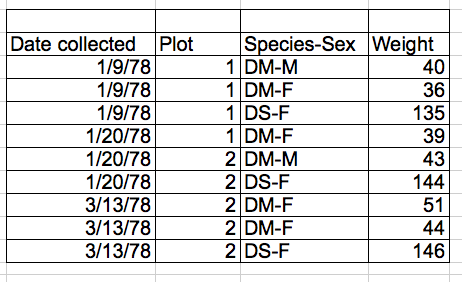
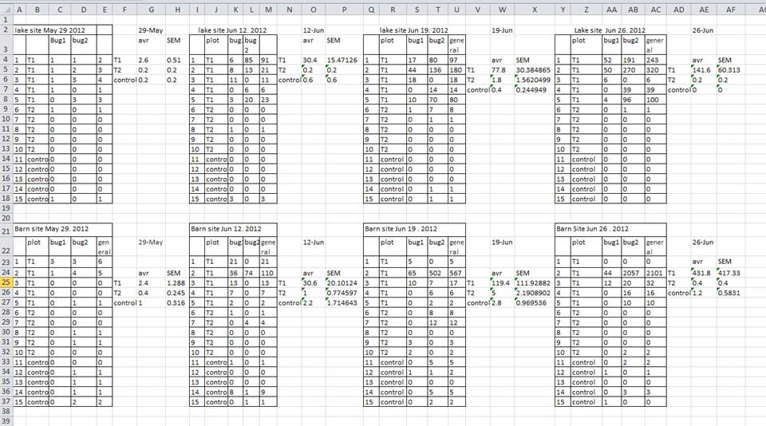
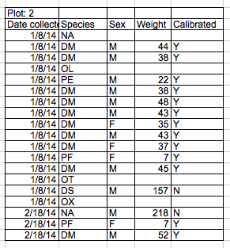
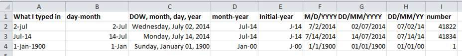
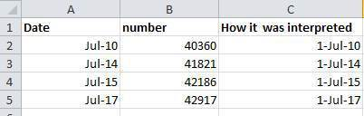

Title: Data organisation and management
Date: 2016-11-10  
Summary: Introduction to data management with spreadsheets and databases

---

# Data organisation with spreadsheets

Lesson adapted from Data Carpentry's "Spreadsheets for ecology"- lesson ([CC-BY](https://creativecommons.org/licenses/by/2.0/) license): http://www.datacarpentry.org/spreadsheet-ecology-lesson/

Etherpad notes available at: https://etherpad.wikimedia.org/p/jyybio_day-01-pm_data-organisation

---

## Before the lesson

Prerequisites:
* You are familiar with spreadsheets

## After the lesson

You will know about:
* What spreadsheets are suitable for, and what are not suitable for
* Good data entry practices
* Dates in spreadsheets
* Exporting data from spreadsheets

---

## Background
In this lesson, we're going to talk about:
* Good data entry practices - formatting data tables in spreadsheets
* How to avoid common formatting mistakes
* Dates as data - **beware!**
* Basic quality control and data manipulation in spreadsheets
* Exporting data from spreadsheets

We will NOT teach you:
* How to do *statistics* in a spreadsheet
* How to do *plotting* in a spreadsheet
* How to *write code* in spreadsheet programs

Questions:
* How many people have used spreadsheets in their research?
* What kind of operations do you do in spreadsheets?
* Which ones do you think spreadsheets are good for?

## Problems with spreadsheets
Spreadsheets good for data entry, but used for much else
* Tables for publications
* Generating statistics
* Figures

Example:
* Accidentally sorted only a single column and not the rest of the data in the spreadsheet
* What have **you** accidentally done in spreadsheets?
	* As people answer, highlight some of these issues with spreadsheets

["Gene name errors are widespread in the scientific literature" Genome Biology 2016](https://genomebiology.biomedcentral.com/articles/10.1186/s13059-016-1044-7)
* Septin 2 (SEPT2) -> 2<sup>nd</sup> September
* RIKEN identifiers converted to floating numbers, e.g. 2310009E13

## Data entry and cleaning

Keep track of your steps!

Keep raw data raw!

Structuring data:
* All variables in columns
* Each observation in its own row
* Don't combine multiple data in one cell
* Leave the raw data raw
* Export data in text- based format  

**columns = variables, rows = observations, cells = data**

Not like this:  


But like this:  


Excellent (R) reference: Hadley Wickham, *Tidy Data*, Vol. 59, Issue 10, Sep 2014, Journal of Statistical Software. <http://www.jstatsoft.org/v59/i10>.

Exercise:
* Download and open data: https://ndownloader.figshare.com/files/2252083
* Two field assistants conducted the surveys, one in 2013 and one in 2014, and they both kept track of the data in their own way. Now you're the person in charge of this project and you want to be able to start doing statistics with the data.
* With the person next to you clean the data and put them all in one spreadsheet **(15 minutes)**
	* Create a new file or tab
	* **Don't modify the original data!**

## Formatting problems
Multiple tables
  
* Remember: row = observation!
* Column names repeated many times

Multiple tabs
* If e.g. each day is a separate tab you might introduce inconsistencies between tabs
* Need to combine everything before analysing – extra step
* Instead, could just add new column

Not filling zeros
* To a human zero and an empty cell might be similar
* To a computer zero is a number and empty is disregarded

Bad null values
* Don't use numerical values for null! (e.g. -999)  


Using formatting to convey information  




Prettifying data with formatting
* E.g. merging cells – NO!

Commenting cells

More than one piece of info / cell
* Don't include units in cells
* Don't write e.g. 1M, 1F

Field name problems
* Avoid spaces, numbers and special characters
* Spaces and special characters can be misinterpreted by parsers
* Underscores and CamelCase are good options

Special characters in data
* Avoid copying special characters such as newlines, tabs, quotation marks etc.
* Treat cells as simple web forms – only text and spaces

Inclusion of metadata in tables
* See above
* Save metadata as separate file in same directory

## Dates as data
Dates usually stored in one column
* Not a good idea due to storing and handling problems (show example in messy data spreadsheet)
* Instead, store as separate columns: day, month, year or year, day-of-year
* NOTE: 1899-12-31 (1904 default for mac) be careful when exporting dates from Excel!  


Excel stores dates as integers
* Counts number of days since 1899-12-31
* This makes adding and subtracting dates easy
* Be aware of this! Other programs might interpret this differently

Best practices:
* Day, month, year
	* Eliminate chances of ambiguity  
  


* Year, day-of-year
	* Easy to incorporate year as a factor, easy to calculate passage of time within year
	* How?  


## Quality assurance
*Before* entering data
* Use “Data validation” or “Validity”
* Can also limit options that with drop-down list

## Quality control
*After* entering data
* Save original data with formulas
* Save new file WITHOUT formulas (moving cells can cause problems)
* Create ReadMe file tracking your manipulations

Sorting can be used to get bad values to top of bottom of column  
Conditional formatting

## Exporting data
Don't export as xls/xlsx
* Propriety format

Use universal, open, static format
* CSV
* Tab-delimited

A note on cross-platform interoperability
* Most coding and statistical environments use UNIX-style line endings (\\n)
* Windows uses its own ending (\\r\\n)
* Can be problematic when shifting data between Windows and Mac/Unix
* Can be fixed with Git (http://nicercode.github.io/blog/2013-04-30-excel-and-line-endings)
* or a small helper application(http://dos2unix.sourceforge.net/)

## Caveats of popular data and file formats
Be careful if your data contains commas as values!
* E.g. http://www.datacarpentry.org/spreadsheet-ecology-lesson/06-data-formats-caveats.html

What can you do?
* Avoid commas
* Put values in quotation marks
* Change regional settings
* Use different delimiter (Excel uses semicolons)
* Write a script (this course will help you do that!)

---

# Data management with SQL

Lesson adapted from Data Carpentry's "SQL for ecology"- lesson ([CC-BY](https://creativecommons.org/licenses/by/2.0/) license): http://www.datacarpentry.org/sql-ecology-lesson/

---

## Before the lesson

Prerequisites:
* -

## After the lesson

You will know about:
* What is a database
* How to perform basic queries from databases
* How to agregate data from databases
* How to join data from databases

## Introduction to SQL
What we will learn:
* Subsetting
* Grouping subsets
* Performing calculations
* Combining data

This will be done in a **reproducible** fashion, **without** modifying the original data

---

## Basic queries
The data:
* https://figshare.com/articles/Portal_Project_Teaching_Database/1314459
* Time series for small mammal community in southern Arizona
* Studying impact of rodents and ants on plant community for almost 40 years
* 24 plots with different experimental manupulations
* Simplified version of original dataset, which has been used inover 100 publications: http://esapubs.org/archive/ecol/E090/118/

Challenge:
* What info contained in each file?
* What information can I learn about Dipodomys species in the 2000s, over time?
* What is the average weight of each species, per year?

What would I need to answer these questions? Which files have the data? What operations would I need to perform if I were doing this by hand?

We will need to:
* Select subsets of the data
* Group the subsets
* Do calculations on the data
* Combine data across spreadsheets

Whey relational databases?
* Data separate from analysis
* Fast even with large datasets
* Improved data quality (type constraints, forms in some applications)
* Relational database query concepts used in R and Python

Database management systems
* SQLite
* MySQL
* PostgreSQL
* MS Access
* FIlemaker Pro

[Let's start](http://www.datacarpentry.org/sql-ecology-lesson/00-sql-introduction.html#relational-databases)

## Basic queries

### Selecting data

Selecting is performed with the `SELECT` command. Selecting a single column from a table:
```sql
SELECT year
FROM surveys;
```

Selecting multiple columns:
```sql
SELECT year, month, day
FROM surveys;
```

How about all columns in a table?
```sql
SELECT *
FROM surveys;
```

### Getting unique values

Identifying individual unique values is performed with the `DISTINCT` command:
```sql
SELECT DISTINCT species_id
FROM surveys;
```

What happens if we specify multiple columns like this?
```sql
SELECT DISTINCT year, species_id
FROM surveys;
```
-> We get unique pairs of values

### Calculating values

Simple arithmetic operators and built-in functions (e.g. rounding) are easy to use:
What happens if we specify multiple columns like this?
```sql
SELECT year, month, day, weight/1000.0
FROM surveys;
```

Why did we use a floating value for the division? What happens if we just divide by 1000?
```sql
SELECT year, month, day, weight/1000
FROM surveys;
```

Rounding:
```sql
SELECT plot_id, species_id, sex, weight, ROUND(weight / 1000.0, 2)
FROM surveys;
```

> Write a query that returns The year, month, day, species_id and weight in mg

### Filtering

By using the `WHERE` clause we can filter our data:
```sql
SELECT *
FROM surveys
WHERE species_id='DM';
```

Multiple clauses can be used with logical operators like `AND`:
```sql
SELECT *
FROM surveys
WHERE (year >= 2000) AND (species_id = 'DM');
```

`OR`
```sql
SELECT *
FROM surveys
WHERE (species_id = 'DM') OR (species_id = 'DO') OR (species_id = 'DS');
```
If you have many `OR` clauses yuo can use `IN`:
```sql
SELECT *
FROM surveys
WHERE (year >= 2000) AND (species_id IN ('DM', 'DO', 'DS'));
```

> Write a query that returns the day, month, year, species_id, and weight (in kg) for individuals caught on Plot 1 that weigh more than 75 g

### Commenting

If you are writing more complex queries it is a good idea to add comments with two dashed lines `--`:
```sql
-- Select all columns from the srveys table
SELECT *
FROM surveys
-- Get only records from the year 2000
WHERE (year >= 2000) 
-- And those which belong have the species_id DM, DO or DS_
AND (species_id IN ('DM', 'DO', 'DS'));
```

### Sorting

For sorting we use the `ORDER BY` command:
```sql
SELECT *
FROM species
ORDER BY taxa ASC;
```

The default order is ascending (`ASC`), use `DESC` to get a descending order:
```sql
SELECT *
FROM species
ORDER BY taxa DESC;
```

By using several fields for ordering we can order e.g. first by genus, then by species (order read from left to right):
```sql
SELECT *
FROM species
ORDER BY genus ASC, species ASC;
```

> Write a query that returns year, species_id, and weight in kg from the surveys table, sorted with the largest weights at the top

> Combining it all together. Using the surveys table write a query to display the three date fields, species_id, and weight in kilograms (rounded to two decimal places), for individuals captured in 1999, ordered alphabetically by the species_id.

### Creating views

Instead of writing long queries to get certain subsets of data, we can create views to quickly access our data:
```sql
CREATE VIEW summer_2000 AS
SELECT *
FROM surveys
WHERE year = 2000 AND (month > 4 AND month < 10)
```

## Aggregation

### Group by

First, let's aggregate all of the data with the  `COUNT` and `SUM` functions:
```sql
SELECT COUNT(*), SUM(weight)
FROM surveys;
```

Other available functions are `AVG`, `MIN` and `MAX`

> Write a query that returns: total weight, average weight, and the min and max weights for all animals caught over the duration of the survey. Can you modify it so that it outputs these values only for weights between 5 and 10?

We can also use aggregating functions in conjunction with `GROUP BY` to get group- level data:
SELECT species_id, COUNT(*)
FROM surveys
GROUP BY species_id;

> Write queries that return:
> 1. How many individuals were counted in each year.  
> a) in total  
> b) per each species
> 2. Average weight of each species in each year.  
> Can you modify the above queries combining them into one?

### Filtering and aggregating

We previously filtered results with the `WHERE` command, in aggreations we use the `HAVING` command. Instead of using database columns the `HAVING` command uses aggregate functions:
```sql
SELECT species_id, COUNT(species_id)
FROM surveys
GROUP BY species_id
HAVING COUNT(species_id) > 10;
```

To make our queries easier to read we can use the `AS` command to rename the results of aggregate functions. Compare:
```sql
SELECT species_id, COUNT(species_id)
FROM surveys
GROUP BY species_id
HAVING occurrences > 10;
```

with:
```sql
SELECT species_id, COUNT(species_id) AS occurrences
FROM surveys
GROUP BY species_id
HAVING occurrences > 10;
```

> Write a query that returns, from the species table, the number of genus in each taxa, only for the taxa with more than 10 genus

### Oredering aggregated results

It is possible to sort your data with the results of aggregate functions:
```sql
SELECT species_id, COUNT(*)
FROM surveys
GROUP BY species_id
ORDER BY COUNT(species_id);
```

### Null values

SQL defines missing values with the special `NULL` value. Filtering these values is easy:
```sql
SELECT *
FROM summer_2000
WHERE species_id IS NULL
```

or:
```sql
SELECT *
FROM summer_2000
WHERE species_id IS NOT NULL
```

Beware of NULL values. In-built functions do not take NULL values into account but if you might get tripped up if you mare not careful. Compare:
```sql
SELECT COUNT(*)
FROM summer_2000
WHERE species_id == 'PE'
```

with:
```sql
SELECT COUNT(weight)
FROM summer_2000
WHERE species_id == 'PE'
```

Also, be careful with negative queries. For example the sum of non-females and non-males does not add up correctly
```sql
SELECT COUNT(*) 
FROM summer_2000
WHERE sex != 'F'
```

```sql
SELECT COUNT(*) 
FROM summer_2000
WHERE sex != 'M'
```

```sql
SELECT COUNT(*) 
FROM summer_2000
```

Why? Null values were not counted, so what we have is a count of individuals with known sex, not a count of ALL individuals. To fix this we should:
```sql
SELECT COUNT(*) 
FROM summer_2000
WHERE sex != 'M' OR sex IS NULL
```

## Joins and aliases

### Joins

Now we are getting to the heart of SQL, joining tables! So far we have been pulling columns from individual tables, but how do we get more information? Use the `JOIN` command:
```sql
SELECT *
FROM surveys
JOIN species
ON surveys.species_id = species.species_id;
```

What we did above was join the `surveys` and `species` tables using the `species_id` column

Since we have a common column we could have used the `USING` command:
```sql
SELECT *
FROM surveys
JOIN species
USING(species_id);
```

Note! Now we have only one `species_id` column_

Unless we want all of the columns from both tables we can select individual columns, but since we now have several tables we have to more specific about the location of the columns:
```sql
SELECT surveys.year, surveys.month, surveys.day, species.genus, species.species
FROM surveys
JOIN species
ON surveys.species_id = species.species_id;
```
> Write a query that returns the genus, the species, and the weight of every individual captured at the site

Naturally, we can incorporate sorting, filtering and aggregating into joins:
```sql
SELECT plots.plot_type, AVG(surveys.weight)
FROM surveys
JOIN plots
ON surveys.plot_id = plots.plot_id
GROUP BY plots.plot_type;
```
> Write a query that returns the number of genus of the animals caught in each plot in descending order

> Write a query that finds the average weight of each rodent species (i.e., only include species with Rodent in the taxa field)

### Functions

We have previously used functions such as `SUM`, `COUNT` and `AVG` on entire columns. In addition, there are functions that operate on indivual cells. For example `IFNULL` and `NULLIF` can be used to specify values in place of  `NULL`, or to set `NULL` values for certain values. For example, to specify `U` instead of `NULL` sex values:
```sql
SELECT species_id, sex, IFNULL(sex, 'U') AS non_null_sex
FROM surveys;
```

> Write a query that returns 30 instead of NULL for values in the hindfoot_length column

> Write a query that calculates the average hind-foot length of each species, assuming that unknown lengths are 30 (as above)

`IFNULL` is especially useful in joins since `NULL` values are ignored by default! By specifying a valid value we can include these rows:
```sql
SELECT surveys.year, surveys.month, surveys.day, species.genus, species.species
FROM surveys
JOIN species
ON surveys.species_id = IFNULL(species.species_id, 'AB');
```

> Write a query that returns the number of genus of the animals caught in each plot, using IFNULL to assume that unknown species are all of the genus “Rodent”

`NULLIF` performs the opposite of `IFNULL`. It works by setting the value of a cell to `NULL` if a condition is met, e.g.:
```sql
SELECT species_id, plot_id, NULLIF(plot_id, 7) AS partial_plot_id
FROM surveys;
```

There are plenty more functions available here: https://sqlite.org/lang_corefunc.html

> Using the documentation from the link above, write a query that returns genus names, sorted from longest genus name down to shortest

### Aliases

In order to keep things concise and clear we can use aliases to rename tables:
```sql
SELECT surv.year, surv.month, surv.day, sp.genus, sp.species
FROM surveys AS surv
JOIN species AS sp
ON surv.species_id = sp.species_id;
```

...and columns
```sql
SELECT surv.year AS yr, surv.month AS mo, surv.day AS day, sp.genus AS gen, sp.species AS sp
FROM surveys AS surv
JOIN species AS sp
ON surv.species_id = sp.species_id;
```
---