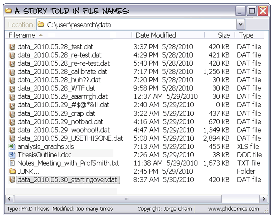

Before the course
-----------------

Prerequisites:
-   a basic knowledge of the **Unix shell** (cf. day one of bootcamp)
-   a basic knowledge of **programming with Python** (cf. day two
    of bootcamp)

After the course
----------------

After completing this course you will know:
-   what is version control and what it can do for you
-   how to set up a new repository for your project
-   how to track files, commit changes and view their history
-   how to revert to a previous state of your project
-   how to share your code publicly

Plan
====

-   Intro to Git with command line to understand its functioning, but
    GUI exists (try it at the end of the workshop)

Overview
--------

-   Introduction to version control
-   Setting up and using Git
-   Basic Git usage
-   Setting up a remote repository for collaborative work
-   Cloning, pushing and pulling
-   Workflow example for a single developer

1. Introduction to version control
==================================

1.1 A common problemm
---------------------

-   Some common issues arise when files are not version-controlled:



-   This happens not only for data, but for scripts also... How can we
    do it better?

1.2 Reproducibility of research?
--------------------------------

-   Research should be reproducible by others.
-   This refers to the experiments generating the data, but also to the
    analysis of the data.
-   The first researcher who will need to reproduce your results is
    likely to be **you**.

A lab notebook for analyses ?

-   Lab books make lab work traceable. Analyses should also
    be traceable.
-   Analysis steps must be recorded, and reverting to any previous step
    must be possible.
-   This ensures that we always exactly know how a result was generated.

1.3 A possible solution: version control
----------------------------------------

-   **Version control** is a tool to **keep track of file changes**.
-   However, version control softwares offer more than simply recording
    successive versions of a file.
-   Version controlled projects can be **forked**, **merged** and
    **shared with collaborators**.
-   Interesting both for **collaborative work** and for **single
    researcher** (the single researcher case will be developped in more
    details later)

1.4 Example of a version control flow for a Python script
---------------------------------------------------------


-   **V1**, **V2**, and **V3** are successive versions of the script
-   **V4** is committed, but then a mistake is found. We revert to
    **V3**
-   A new, correct **V4** is committed
-   **V5** and **V6** are successive versions of the script
-   At this point, we want to implement a new feature that might be
    interesting, but which is experimental. In order to keep **V6**
    clean, we create a new branch in which we can experiment with the
    script without damaging the stable **V6**
-   **V6b** and **V7b** are successive versions of the experimental
    script
-   At some point, the experimental changes are mature and we want to
    merge them back into the master branch. **V7b** and **V6** are
    merged together into **V8**
-   We realise we want to revert to a previous version of one function
    in the script. For this function, we revert to the code present in
    **V2**, keep all the rest as it is in **V8** and commit it as **V9**
-   **V10** is the next commit

1.5 What are the available tools?
---------------------------------

-   Existing version control tools
    -   [Subversion](https://subversion.apache.org/)
    -   [Bazaar](http://bazaar.canonical.com/en/)
    -   [Mercurial](http://mercurial.selenic.com/)
    -   [Git](http://git-scm.com/), which is one of the most popular
        ones nowadays
-   Online servers for repositories
    -   [BitBucket](https://bitbucket.org/) (free private repositories)
    -   [GitHub](https://github.com) (free for public repositories but
        not for private repositories)

Installing and setting up Git
=============================

Git installation
----------------

-   Install Git

Git basic setup
---------------

-   Set up the PATH for accessing it from the command line
-   Set up the user name and email

``` {.bash}
git config --global user.email "matthieu.d.bruneaux@jyu.fi"
git config --global user.name "Matthieu Bruneaux"
```

2. Basic Git usage
==================

We want to develop some Python code to analyze DNA coding sequences. The
sequences we are going to use in our test can be found *here*. We will
use Git to track the changes in our project.

2.0 Set up your project folder
------------------------------

-   For now all the work will be done on the remote server we used
    yesterday for the lesson about the Unix shell.
-   This means you will learn how to use Git with the command line. This
    will help you to understand better how Git works.
-   Later on, you can use one of the numerous Git graphical user
    interfaces to use Git with your projects.

### Your tasks

#### Connect to the server

-   Log into the remote server using `ssh` (GNU/Linux or Mac) or
    `putty` (Windows)

-   For `ssh` connection:

    ``` {.bash}
    ssh jyybioxx@130.234.109.113
    ```

-   Username: `jyybioxx`

-   Password: on the whiteboard!

#### Create your project folder

-   Create a new folder for your project:

    ``` {.bash}
    mkdir myProject
    # Go into the new folder
    cd myProject
    ```

#### Download the fasta file into your project folder

-   We can use the `wget` command to download a file from the shell. The
    syntax is:

    ``` {.bash}
    wget myUrl
    # where myUrl is the url of the file to download
    ```

-   Run the command:

    ``` {.bash}
    wget 
    ```

2.1 Tracking files and committing changes
-----------------------------------------

### Your tasks

-   Write a simple Python function that takes a sequence string (DNA
    nucleotides), and checks that it starts with a start codon. Test it
    with at least the three first sequences from the fasta file.

-   Save your Python to a file
-   Commit your first version of the script
-   What happens if you test your function with the unicorn's sequence?
    Modify your function accordingly, and perform a second commit.

### What we learnt about

-   Track a file and commit changes
-   Git staging area, commit hashes
-   Git log and graphical interfaces
-   Amend commit messages

Diff and reverting to previous versions
---------------------------------------

### Overview

-   Diff between files
-   How to revert to a previous version

### Your tasks

-   Write a function that takes a sequence string, and returns a list
    of codons. Test your function with a few sequences. What happens
    with the bat sequence?
-   Modify your function to take it into account. Check the differences
    between your files and commit.
-   Wait, your collaborator told you a T was missing on the
    bat sequence. Modify the sequence data in the fasta file, commit the
    new data file, and revert to the previous version of your function.

Branching and merging
---------------------

### Overview

-   Branching and merging
-   Resolving merge conflicts

### Your tasks

-   Now you are ready for some serious analysis. You think that
    histidine is a particularly interesting amino-acid, and you would
    like to count how many histinde-coding triplets you have per
    coding sequence. However, this is a quite experimental part of your
    analysis: create a new branch, add your function and test it. When
    you are satisfied with it, merge it to your master branch.
-   Actually, it would be nice if your function could count **any**
    codons, not just histidine-coding ones. This is even more
    experimental, so create another branch, modify your function, and...
-   Wait, your supervisor asks you to add as quickly as possible a
    checking step so that only A, T, G, C are allowed in the sequences.
    This is a crucial update, so do it in your master branch and commit.
-   Now you can go back to your experimental branch. Finish your
    function modification, test it and merge it with your master branch
    when you are happy.
-   Resolve merging conflicts as they arise.

Setting up and using remote repositories
========================================

Cloning a remote repository
---------------------------

### Overview

-   Getting a copy of a public repository

### Your task

-   Search GitHub for a python script which could do enrichment test of
    gene ontologies. You can search terms like "python", "enrichment",
    "gene ontology". Note that sometimes people refer to "gene ontology"
    as "GO".
-   Clone an interesting repository to your computer.
-   Have a look at the history of the repository and at the files. Did
    the author used any branches?
-   Modify one of the files and commit your changes.

Creating a new remote repository and pushing code
-------------------------------------------------

### Overview

-   Set up a GitHub account
-   Create a new repository

### Your tasks

-   You are pretty proud of your python code to analyse coding sequences
    and want to do good to the world: let's share it publicly!
-   Create a GitHub repository for you (you can use a pseudonyme and
    delete the account afterwards if you don't want to gieve GitHub your
    real information)
-   Set up your remote repository links
-   Push your code online.

Collaborating to a public repository
------------------------------------

### Overview

-   Fork a repository
-   Make changes and send a pull request

### Your task

-   Fork the existing GitHub repository at
    <https://github.com/mdjbru-teaching-material/pyFastaParser>
-   Clone your fork on your local computer
-   Explore the code, test it, fix any bug you find and add some new
    functionality
-   Push your modifications and send a pull request.

Going further: workflow example for single developper
=====================================================

Resources
=========

links go here

Notes
=====

Exercise: design a set of Python scripts to handle fasta sequences

Coding sequences, check for beginning of ORF, stop-codon, translation,
etc...

Load the translation table from a text file

Track and fix errors in this file

Testing with this file

Profiling: translation with list vs dictionary

What is version-controlled? Scripts, not data, except if hand-generated
data (e.g. transcription of written records)
